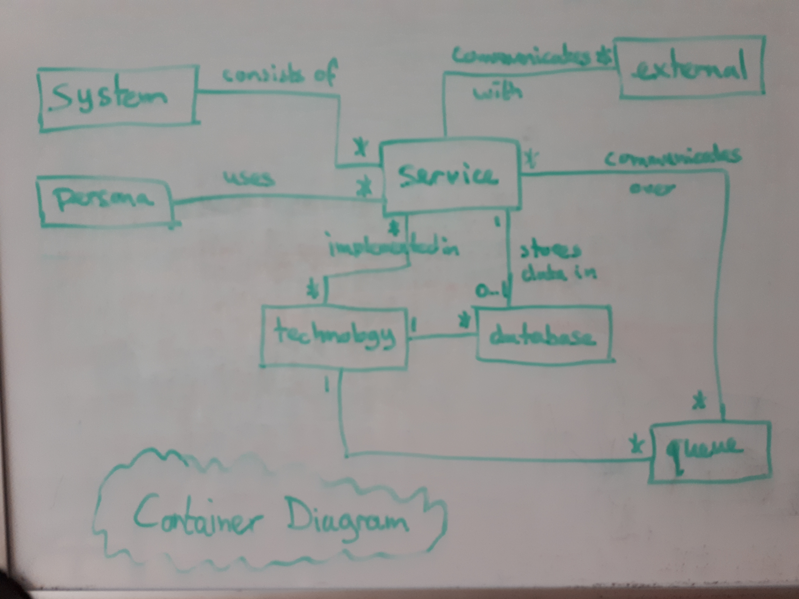
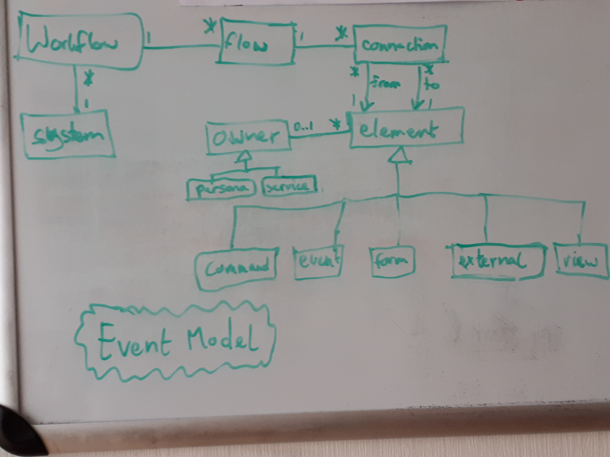

# A model for architecture diagrams

## Introduction

There are many types of diagrams. I regularly use [Context and Container Diagrams](https://c4model.com/) from the C4 Model
for showing the macro-architecture of systems and [Data Flow Diagrams](https://en.wikipedia.org/wiki/Data-flow_diagram) (DFDs)
as the basis for threat modeling.
There is a close relationship between a Container Diagram and a DFD.
Unfortunately, we don't have an underlying model that captures that relationship.
Such a model would allow us to generate both types of diagrams from the same source.

The [Structurizr](https://structurizr.com/) tool can do this for C4 diagrams, but not others.
Unfortunately, its underlying model is fairly simplistic and doesn't offer a lot of precision.
For instance, a service, database, and queue are all modeled as _containers_.
You have to apply tags on the container to make the tool draw them differently.

It would be great to have a better model, one that we can use in more places.
Let's consider another example next to the container diagram / DFD mapping: a container diagram lists technologies.
These technologies could be linked to a [Tech Radar](https://www.thoughtworks.com/radar) and maybe even to a
[Tech Debt](https://en.wikipedia.org/wiki/Technical_debt) inventory.

Another example is an [Event Model](https://eventmodeling.org/posts/what-is-event-modeling/).
It provides a really need overview of the workflows in an event-driven architecture.
Such an architecture will have services that communicate via events that are delivered over queues.
Both services and queues are things you also see in a container diagram, so it would be cool if you could create a model
of your system that captures these things and from which you can generate both types of diagrams.

## Analysis

Let's look at the concepts used in some different types of diagrams:

