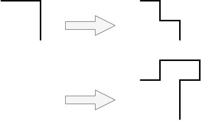
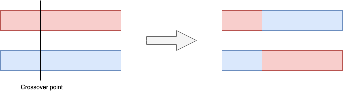

# Architecture diagram layout engines

Maintaining architecture diagrams by hand costs a lot of time.
There are tools, like [GraphViz](https://graphviz.org/), that can automatically lay out a diagram for you.
The results of these _auto-layouts_ are never quite satisfactory, however.

Laying out diagrams is an instance of the more generic problem of
[graph drawing](https://en.wikipedia.org/wiki/Graph_drawing).
We can, therefore, use generic algorithms, like
[force-directed graph drawing](https://en.wikipedia.org/wiki/Force-directed_graph_drawing) to automatically layout out
diagrams.
This is what programs like GraphViz do.
Sometimes they even support [more than one algorithm](https://graphviz.org/docs/layouts/).
These algorithms are also known as _layout engines_.

The problem is that these generic layout engines don't give good results:

- They have more crossing lines than necessary.
- They sometimes even have overlapping shapes.
- They fail to highlight relationships between services that are important for understanding the architecture.
  Examples are the [BFF](https://samnewman.io/patterns/architectural/bff/) and
  [Event-Driven Architecture](https://en.wikipedia.org/wiki/Event-driven_architecture#Event_channel) patterns.
- They look, well, not like something an architect would draw by hand.

This begs the question: **Do we have to choose between costly, beautiful diagrams and cheap, messy ones, or can we have
the best of both worlds?**
At this point, I honestly don't know, but I want to find out!

If it turns out there is no good way to automatically lay out diagrams, then we need to use a hybrid approach:

1. First automatically lay out the diagram using an algorithm that doesn't suck too bad.
2. Then manually improve the layout.

But let's not give up hope just yet.


## Architecture diagram specifics

If generic graph drawing algorithms don't give good results, then our only hope lies in something that's specific to
architecture diagrams, which benefits from its distinct properties.
Here are some of those properties:

- Nodes in a diagram have shapes with non-negligible sizes.
  Text is usually placed inside the node's shape rather than next to the node.
  Edges may be attached to different connectors on the same shape.
- Diagrams usually lay out nodes in a grid and connect them with orthogonal edges, not straight lines.
- Architecture diagrams are usually moderate in size, on the order of 10-100 nodes.
  Anything bigger than that and people start grouping services to preserve understandability.
- Not all nodes in the graph are created equal.
  Depending on the type of diagram we may have users, external systems, services, databases, queues, and others.
  We may separate nodes of different types, e.g. a container diagram would show users and external systems on the
  outside and services, databases, and queues grouped together on the inside.
- Depending on the architecture, there are specific groupings we expect to see between the node types, like one
  database per service in a microservice architecture, one service writing to and one service reading from a
  database in CQRS, or multiple services reading from and writing to a queue in an event-driven architecture.

Let's look at some of these differences in more detail to determine how they can impact laying out a diagram.


### Nodes in diagrams

In generic graph drawings, nodes are depicted as small circles, with any text next to them.
Edges are drawn as straight lines, with or without arrows (undirected vs directed graphs).

In architecture diagrams, edges are generally directed or even bidirectional.
Nodes in architecture diagrams are different types of shapes, with different ratios of width to height.
Here are some examples:

| Shape           | Ratio |
|-----------------|-------|
| Persona         | 3x4   |
| External system | 3x1   |
| Service         | 2x1   |
| Database        | 3x2   |
| Mobile phone    | 1x2   |

To accommodate these different ratios, it's best to think of a cell in the grid as a 12x12 mini-grid, where the shape
occupies some cells in the middle of the mini-grid.
Consider a service in a container diagram with a ratio of 2:1.
It would be drawn as a block of 6x3 cells in the middle, with 3 empty columns before and after it, 4 empty rows above
it, and 5 empty rows below it.
The empty rows and columns are then used to draw the lines and arrows of edges connecting to the node.


### Edges in diagrams

In generic graphs, edges are usually drawn as straight lines.
Those may or may not have arrows (directed vs undirected graphs).

In architecture diagrams, edges are generally directed or even bidirectional.
They are usually drawn as orthogonal lines rather than point to point.
Orthogonal lines consist of one or more line segments that are either completely horizontal or completely vertical.
The points in between these segments are the _bends_.
We want as few bends as possible, but sometimes we need a larger number of them to avoid crossing edges, which is worse.

We saw that in a grid layout the shapes take up a significant portion of the cells, with edges drawn in the remaining
space.
In case that space is not enough, we need cells without shapes to draw the edges in.

We can use the fact that shapes have non-negligible sizes to allow different edges to connect at different points on the
same shape.
Different types of shapes may have different numbers of these _connectors_, but a common choice is 3 each on the top,
left, right, and bottom.
Using more connectors significantly reduces the odds of edges crossing each other and even of overlapping.

Some smaller shapes, like those for persona or for mobile phone, may have only a single connector.
This point is usually the center of the shape.
Edges connecting to it should be drawn "under" the shape, unless they have an arrow at the single connector.

Even shapes with more connectors may have them inside their boundaries, rather than on their sides.
This is especially likely for round shapes, like those for databases and queues.
Here, we want to draw the edges "on top of" the shape, even when there is no arrow at the connector.


### Diagram size

Earlier we said that diagrams are graphs of moderate size, on the order of 10-100 nodes.
But even the lower bound of 10 is problematic.
Let's assume for a moment that all we have to do is line up the nodes in one straight line.
This is obviously an over-simplification, the real problem is much harder.
Even for this simple layout, there are 10! = 3.6M possibilities.
If we process one possibility per ms, then we'd need about an hour.
For larger diagrams, this number increases exponentially.
So obviously this isn't going to work.

If the search space is too big to search exhaustively, then a couple of options remain:

1. Prune the search space to make it smaller by quickly rejecting significant parts of it.
  Then comprehensively search the remainder of the space.
2. Use heuristics.
3. Use a local search algorithm, like Simulated Annealing (SA) or Genetic Algorithm (GA).

I'm not aware of any techniques that work well using the first or second approaches.
The first one doesn't even sound very promising.
The second one would require very deep insight into the problem space and even then isn't guaranteed to work.

That leaves the third option.
SA and GA approaches are similar in spirit, but technically different.
I have prior experience with GAs, so let me start there.


## Genetic algorithms

A quick Google search shows that several people have attempted to automatically lay out graphs using Genetic Algorithms.
Most of this work is on graphs rather than diagrams and most present results that wouldn't be satisfactory for diagrams.
But some seem to produce decent results, so this sounds like a promising approach to try.

A Genetic Algorithm requires the following:

1. A representation of solutions as a _genome_.
  This genome usually consist of multiple units, the _genes_.
  The GA starts with an initial collection of random genomes in its _pool_.
2. A way to evaluate how well the solution solves the problem.
  This _fitness function_ takes the genome as input and outputs the _fitness_, a number between 0 (bad) and 1 (good).
  The GA's job is to find a genome with as high a fitness as possible.
  GAs usually tackle multidimensional optimization problems.
  In those cases it's common for the fitness function to be the weighted average of several partial fitness functions,
  one per dimension.
  Each partial fitness function also returns numbers between 0 and 1.
3. Ways to derive new solutions from existing ones.
  These _genetic operators_ take one or more genomes as input and produce one or more new genomes.
4. A way to select genomes from the pool to form a new pool in a new _iteration_.
  This _selection mechanism_ is usually solution-agnostic and takes only the fitness of genomes into account.
  Examples are roulette wheel selection, rank selection, and tournament selection.
5. A way to determine when to stop iterating.
  This _termination mechanism_ is also usually solution-agnostic, looking only at the fitness of genomes in the pool.
  The simplest termination mechanism is to perform a fixed number of iterations.
  More advanced termination mechanisms look at the fitness of the genomes and stop when it reaches a plateau or when
  it reaches some known best value (which is usually lower than 1).

Let's look at these parts in the context of laying out diagrams.


### The genome

#### Nodes

A genome has to encode the solution, in this case the layout of the nodes and edges in the graph.
If we assume a grid layout, then we can assign integer coordinates to each cell in the grid.
The genome then has to assign nodes to those coordinates.

How big does the grid need to be?

A node in the grid has 8 neighbors.
For highly connected nodes, some of that space can't be used, since it's needed to draw edges.
To be on the safe side, let's use only 1 out of every 3 cells for nodes.
Then the grid must have at least `3n` cells.

The optimal grid is usually not square.
By making one side of the grid longer than the other, we create more room to connect nodes.
But the grid must also be tall enough.
In practice, ratios of 2:1 to 4:1 seems to work best.
We can either pick something in that range, or try different ratios and pick the best result.
Whether this is feasible depends on how fast the GA is.
Alternatively, we could just use a square grid where each side is `2⌈√(3n)⌉` and depend on compaction later.
For the best results, we'll have to do compaction anyway.
The downside is the potentially longer runtime for the GA, since the search space is larger.
We'll discuss compaction below.

Most shapes (e.g. rectangles) are drawn wider than high, although the reverse certainly occurs (e.g. person shapes).
To be visually pleasing, it then makes sense for the diagram itself to be wider than high.

Let's look at an example with a ratio of 2:1.
If `w` is the width of the grid and `h` is its height, then this means that we want `w=2h`.
The number of cells in the grid is then `wh = 2h² = 3n`, which gives `h=⌈√(3/2·n)⌉`.
For example, if `n=16`, then `h=5` and `w=10`.

Now that we have worked out the coordinates, we need to design the genome so that it assigns those coordinates to the
nodes.
The most straightforward representation lists the coordinates for the nodes one after the other.
In other words, a single gene consists of integer x and y coordinates, where `0 ≤ x ≤ w-1` and `0 ≤ y ≤ h-1`, and a 
genome is a sequence of `n` genes, one per node.

When we initialize the pool at the start of the GA, we're supposed to create random genomes.
We should, however, make sure that all nodes take different positions. 


#### Edges

Since edges in a diagram are orthogonal lines, we need to store the position of all the bends.
Unlike nodes, which are fixed to the center of the grid's cells, edges can go anywhere, so their positions aren't
grid coordinates.
It makes sense to limit them to the mini-grid cells, which leads to their coordinates being multiples of one-twelfth
of a grid coordinate.

One representation would be a gene that consists of a list of mini-grid coordinates (one per bend).
The first and last point of the edge are also included, and they're limited to the connector points on the respective
shapes.
The genome is then a sequence of genes, one per edge in the diagram.

When we initialize the pool at the start of the GA, we need to randomize the edges too.
We can't just pick random bends; they must make an actual path from the source to the target node.
When the x coordinates of the nodes are the same, we need no bend.
The same holds for when the y coordinates of the nodes match.
Otherwise, we need exactly one bend, with the x coordinate from one node and the y coordinate from the other.


### The fitness function

The fitness function has to convert a genome into a number between 0 and 1.
This single number has to cover multiple dimensions of "goodness" or "badness" of the layout:

1. The number of edge crossings, `c`.
  With many bends a given edge could cross the same edge multiple times.
  We still count this as one crossing.
  If there are `E` edges, then `0 ≤ c ≤ E(E-1)`, so `Fc = 1 - c / E(E-1)` as partial fitness function should work nicely.
2. The number of edge overlaps, `o`.
  This is similar to edge crossings, as so is the partial fitness function `Fo`.
3. Symmetric placement of connections.
  If nodes have 3 connectors per side, then we prefer to use the middle connector if there is only one edge attached, 
  but we want to use the outer two if there are two edges attached.
  The partial fitness function for this, `Fcs`, is like the one for crossings: we calculate the ratio of connections that
  meet our expectations.
4. The size of the grid.
  If instead of a `w·h` grid we can make do with something smaller, then that's better.
  In other words, we prefer solutions where entire rows or columns are unused.
  The partial fitness function for this, `Fs`, is the ratio of completely empty rows and columns.
5. The relationships between different types of nodes.
  For instance, in a container diagram you usually want to put the personas and external systems at the edge and the
  services, databases, and queues in the middle of the diagram.
  The partial fitness function for this, `Fr`, depends on the diagram type.
  For the example of a container diagram, `Fr`, would calculate the ratio of nodes that meet the above relationship
  requirement.
6. We like the visual expression of architectural patterns.
  For example, if the architecture is based on microservices, each of which has their own database, then we'd like to
  see the same spatial relationship between the service and its database everywhere.
  This depends on being able to recognize those patterns, of course.
  Let's keep this out of scope for the first iteration.
7. Symmetric placement of nodes.
  Symmetry is always appealing, but while it's easy to spot by the human eye, it's not as easy to define in a partial
  fitness function.
  Let's keep this out of scope for the first iteration.

Combining all of the above gives:

```
F = Wc·Fc + Wo·Fo + Wcs·Fcs + Ws·Fs + Wr·Fr
```
where
```
Wc + Wo + Wcs + Ws + Wr = 1
```


### The generic operators

Now we need some operators that introduce the variety upon which selection works.
The traditional genetic operators are _mutation_ and _crossover_.

#### Mutation

Mutation takes a genome and changes it randomly in a single spot.
Since our genomes consist of two parts, we need at least two mutation operators.

Mutation for node genes can move a node to a different position in the grid.
Since no good solution will ever have two nodes in the same position, it makes sense to ensure that mutation doesn't
inadvertently do that.
For instance, we could move a node to a random empty position or swap two nodes.
Either of those options can be restricted to neighbors or be allowed to operate over the entire grid.
We can even leave that up to chance, where more local operations have higher probability.

Any movement of a node invalidates the bends that the GA had built up thus far, so they need to be reset.
We can use the same procedure for that as when initializing the genome.

Mutation for edge genes falls into two categories: changing endpoints and changing bends.
For the first, we could move the edge to a random unoccupied connector.
We may even have to allow picking an occupied connector to avoid getting stuck in a local optimum.
Whenever we change an endpoint, we have to reset the bends to keep the edge orthogonal.

Mutating bends is a bit more involved.
We show the basic patterns here, but these can be expressed in multiple directions.

For straight edges, i.e. without bends, we can introduce 3 or 4 bends:


Introducing 3 bends is only possible if the connector allows connecting at multiple angles, which wouldn't normally be
the case.

For edges with bends, we can either remove bends or add more.
Removing bends is the inverse of an operation where we introduce bends.
Introducing bends replaces one bend with either 3 or 5 new ones:



Introducing 5 bends is only possible if there is room in the grid.


#### Crossover

Crossover is a genetic operator that takes two genomes (the parents), breaks each of them up into two pieces, and
assembles two new genomes (the children) that consist of one piece of each of its parents.



This is actually a special case of partial crossover, where the swapped part is at the end of the genome.
But that needn't be the case:


Crossover is useful because it allows jumping large distances in the solution space.
However, I'm having a hard time seeing how this would apply to edges, since those are constrained by the nodes that
they connect.

For the node part of the genome, we also can't naively swap gene sequences, since that could violate the property that
no two nodes may occupy the same position.
Technically we could allow it and then punish it in the fitness function, but the GA performs better if it simply
can't produce invalid "solutions".

One way that could work is to start at a random gene in one genome and keep adding subsequent genes as long as the
nodes in the bounding rectangle of one parent match those in the same bounding rectangle in the other parent.

It's not guaranteed that this would produce a sequence of more than one gene.
If the sequence is only one gene long, then the crossover operation degenerates to a mutation that swaps nodes.
So we should remove that mutation operator.

Instead of picking two random genomes to cross over, we could pick one and then pick the one genome from the remainder
that gives the longest swap sequence.
Many variations on this theme are possible.
We need to experiment a little here to see what works and what doesn't.

As before, any time a node moves in the grid, we have to reset all its connections.
