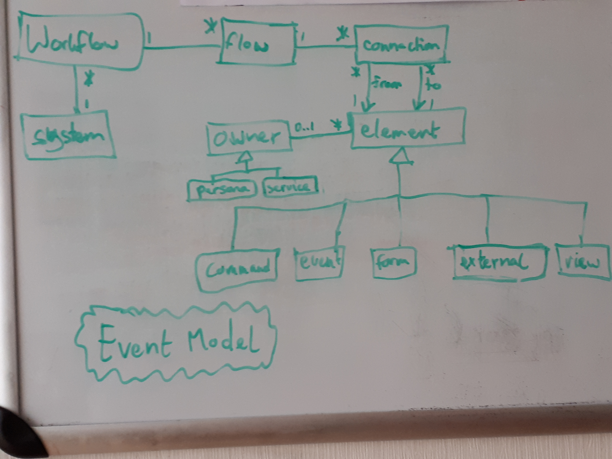
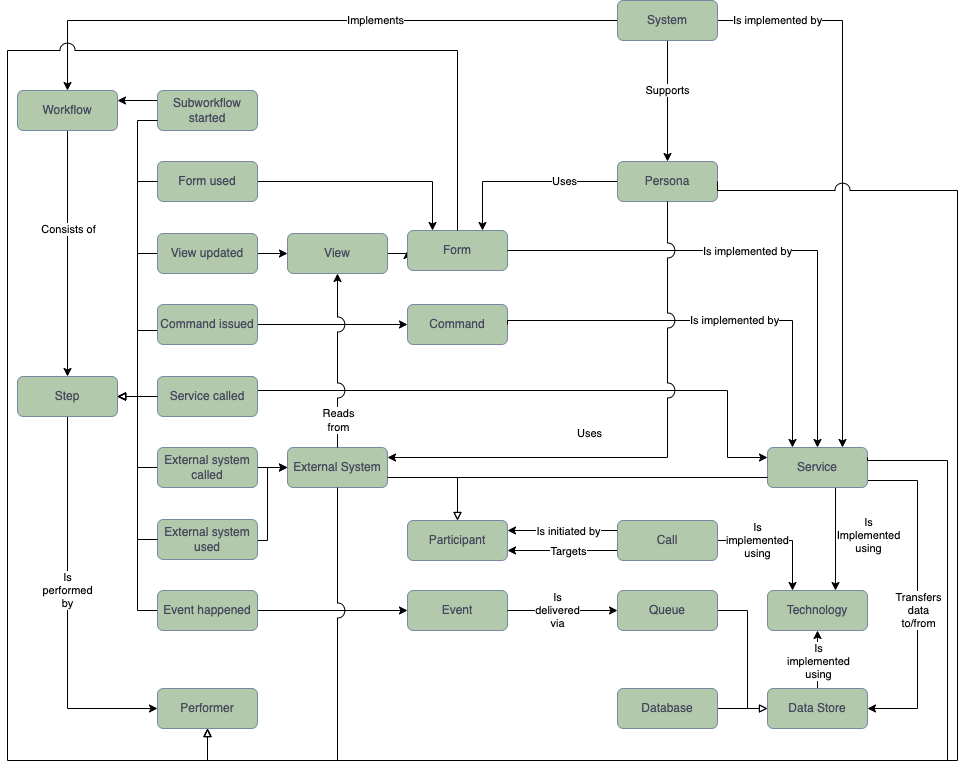

# A model for architecture diagrams

## Introduction

There are many types of diagrams. I regularly use [Context and Container Diagrams](https://c4model.com/) from the
C4 Model for showing the macro-architecture of systems and
[Data Flow Diagrams](https://en.wikipedia.org/wiki/Data-flow_diagram) (DFDs) as the basis for threat modeling.
There is a close relationship between a Container Diagram and a DFD.
Unfortunately, we don't have an underlying model that captures that relationship.
Such a model would allow us to generate both types of diagrams from the same source.

The [Structurizr](https://structurizr.com/) tool can do this for C4 diagrams, but not others.
Unfortunately, its underlying model is fairly simplistic and doesn't offer a lot of precision.
For instance, a service, database, and queue are all modeled as _containers_.
You have to apply tags on the container to make the tool draw them differently.
Another annoyance is that Structurizr only supports unidirectional relationships.

It would be great to have a better model, one that we can use in more places.
Let's consider another example next to the container diagram / DFD mapping: a container diagram lists technologies.
These technologies could be linked to a [Tech Radar](https://www.thoughtworks.com/radar) and maybe even to a
[Tech Debt](https://en.wikipedia.org/wiki/Technical_debt) inventory.

Another example is an [Event Model](https://eventmodeling.org/posts/what-is-event-modeling/).
It provides a really neat overview of the workflows in an event-driven architecture.
Such an architecture will have services that communicate via events that are delivered over queues.
Both services and queues are things you also see in a container diagram, so it would be cool if you could create a model
of your system that captures these things and from which you can generate both types of diagrams.


## Analysis

Let's look at the concepts used in the different types of diagrams mentioned before.
I'm sure there are other diagram types that would be useful to include, but for now let's stick with these five.
Here are some quick relationship diagrams that I cooked up to show the concepts used in the diagram types:





I'm sure the above pictures are incomplete.
That's fine, we can refine the model over time.
What's important now is that we can use them as a basis to build a better model for architectural diagrams.


## Conceptual model for architecture diagrams

We recognize the following concepts:

- **Call** A machine-to-machine communication between two _participants_.
- **Command** A request to change the _system_ in some way.
  A command is issued by a _service_, _form_, or _external system_ and handled by a _service_.
- **Data Store** Something that can hold data: either a _database_ or a _queue_.
- **Database** A part of a _system_ that stores data for one or more _services_.
- **Event** A piece of data sent from one _service_ to another, which signals to the recipient that something
  interesting has happened.
- **External system** A software application that the primary _system_ interacts with, but whose details don't concern
  us right now.
  We could define different types of external systems, for instance based on whether they are maintained by the
  organization itself or by a different organization.
- **Form** Part of the system that provides a User Interface to a _persona_.
  A form can show a view, let the _persona_ issue a _command_, or both.
- **Participant** A running piece of code that participates in a _call_, either as the initiator or as the target.
  A participant is either a _service_ or an _external system_.
- **Performer** Someone or something that performs a _step_.
- **Persona** A human that interacts with a _system_.
  A persona is not an actual person, but more the role they play when interacting with the _system_.
- **Queue** A part of a _system_ that temporarily stores data so that one _service_ can transfer that data to another
  _service_ asynchronously.
  The data transferred via the queue may be an _event_ (in which case we could call it an event bus or broker), but it
  could also be something else.
- **Service** A part of a _system_ that is deployed as a single unit, independently of other services.
  In a microservice architecture, this would be a microservice, but the concept also applies to Service Oriented
  Architectures.
  Either way, a service is stateless; it stores its state in a _Data Store_
- **Step** Something that happens in a _workflow_: a _command is issued_, an _event happened_, a _view gets updated_,
  _external system gets called_, etc.
- **System** A software application that helps one or more _personas_ perform their duties and is the focus of the
  diagram.
- **Technology** The languages, frameworks, tools, platforms, etc. used to implement a part of a _system_.
- **View** A subset of the data in the _system_ that is prepared so that it can be easily queried for a specific purpose.
- **Workflow** A sequence of _steps_, during which a _persona_ accomplishes something.




## Representation

The conceptual model allows humans to think about architecture diagrams, but for tools to work with them, we need a
representation that we can store in a file.
We'll use YAML for this purpose, because it's text-based (good for version control), expressive yet terse, 
and widely used.


### Version

An architecture model YAML file may contain a `version` top-level element:

```yaml
version: 1.0
```

If omitted, `1.0` is assumed.
The only valid value at this time is `1.0`.


### System

An architecture model YAML file may contain a `system` top-level element:

```yaml
system:
  name: My system
```

If omitted, a system is inferred from the file name.


### Personas

An architectural model YAML file should contain a `personas` top-level element.
Without personas that the system supports, there would be no point in having the system in the first place.

```yaml
personas:
  cs:
    name: Customer Support
    uses:
      - externalSystem: jira
        description: Updates issues
  dev:
    name: Developer
    uses:
      - externalSystem: slack
        description: Reads notification
      - form: subscriptions
        description: Maintains subscriber
      - form: subscriptionsOld
        description: Maintains subscriber
```

The `personas` element is a map where each item defines a persona.
The `name` is optional; when omitted a human-friendly version of the key is used.

The `uses` list refers to the [external systems](#external-systems) and [forms](#services) the persona uses.


### External systems

External systems are modeled using the top-level `externalSystems` element:

```yaml
externalSystems:
  slack:
    name: Slack
    type: central
  localPlatform:
    name: Local platform
    type: local
    calls:
      - service: api
        dataFlow: send
```

The `externalSystems` element is a map where each item defines an external system.
The `name` is optional; when omitted a human-friendly version of the key is used.

The `type` is also optional.
It can be any string value.
There are no semantics associated with these values, but they can be used for rendering external systems differently.


### Services

Services are modeled using the top-level `services` element:

```yaml
services:
  api:
    name: API
    technologies: server
    dataStores:
      - queue: events
        description: Writes domain events
        flow: send
  form:
    name: Privacy Form
    technologies: serverWithUi
    forms:
      - privacy
    calls:
      - service: api
        description: Calls
        dataFlow: send
        technologies: jsonOverHttp
```

The `services` element is a map where each item defines a service.
The `name` is optional; when omitted a human-friendly version of the key is used.

The value of the `technologies` key is either a string value or a list of string values.
A single string value points to a [technology bundle](#technology-bundles), whereas a list contains individual
[technologies](#technologies).

A service may have an optional [state](#states); if omitted, `ok` is assumed.

The `dataStores` property contains a list of data stores.
Each data store is a map that has either a `queue` or a `database` key, which refers to a [queue](#queues) or
[database](#databases), respectively.

A data store's `dataFlow` may be either `send`, `receive` or `bidirectional`.
When omitted, `bidirectional` is assumed.
This property describes the flow of data from the perspective of the service, so `send` means that the service sends
data to the data store, but gets nothing substantial back.

The `forms` property contains a list of forms implemented by the service.
To specify the form's [state](#states), use a map instead:

```yaml
services:
  form:
    # ...
    forms:
      privacy:
        state: review
```

The `calls` property lists which services and [external systems](#external-systems) this service calls.
The `technologies` for the call works the same way as for the service itself.
The `dataFlow` for the call works the same way as for data stores.


### Databases

Databases are modeled using the top-level `databases` element:

```yaml
databases:
  subscriptions:
    name: Subscriptions & in-flight requests
    technologies: cloudMySql
    apiTechnology: sql
```

The `databases` element is a map where each item defines a database.
The `name` is optional; when omitted a human-friendly version of the key is used.

The value of the `technologies` key is either a string value or a list of string values.
A single string value points to a [technology bundle](#technology-bundles), whereas a list contains individual
[technologies](#technologies).

The `apiTechnology` lists to the technology used to communicate with the database via its API.

A database may have an optional [state](#states); if omitted, `ok` is assumed.


### Queues

Queues are modeled using the top-level `queues` element:

```yaml
queues:
  events:
    name: Domain Events
    description: One topic per event type.
    technologies:
      - pubsub
    apiTechnology: grpc
```

The `queues` element is a map where each item defines a queue.
The `name` is optional; when omitted a human-friendly version of the key is used.

The value of the `technologies` key is either a string value or a list of string values.
A single string value points to a [technology bundle](#technology-bundles), whereas a list contains individual
[technologies](#technologies).

The `apiTechnology` lists the technology used to communicate with the queue via its API.

A queue may have an optional [state](#states); if omitted, `ok` is assumed.


### Technologies

Technologies are modeled using the top-level `technologies` element:

```yaml
technologies:
  cloudSql:
    name: CloudSQL
    quadrant: platforms
    ring: hold
    description: Replace with AWS technology
```

The `technologies` element is a map where each item defines a technology.
The `name` is optional; when omitted a human-friendly version of the key is used.

The `quadrant` specifies the type of technology.
Possible values are `languagesAndFrameworks`, `platforms`, `tools`, and `techniques`.

The `ring` specifies the adoption stage of the technology.
Possible values are `asses`, `trial`, `adopt`, and `hold`.
If omitted, `adopt` is assumed.


### Technology bundles

It's fairly common for a team to have a Golden Path for a tech stack.
This favored list of [technologies](#technologies) gets used for most, if not all, [services](#services).
When both the list of services and the list of technologies used get larger, the burden of specifying the
technologies over and over again increases.

This burden can be reduced by bundling technologies:

```yaml
technologyBundles:
  server:
    - java
    - spring
  serverWithUi:
    - server
    - thymeleaf
```

The `technologyBundles` element is a map where each item defines a technology bundle, which is nothing but a list
of references to technologies and/or other technology bundles.


### States

A system is implemented using [services](#services), which get created, modified, and retired over time.
This lifecycle is captured using the optional `state` property, which can have the following values:

- `ok` - The default. The component is fit for use.
- `emerging` - The component doesn't exist yet or is not quite ready for use.
- `review` - The component is under review; it's not yet clear what it's state is.
- `revision` - The component needs some changes, but it needn't be replaced.
- `legacy` - The component needs to be replaced, but its alternative is still `emerging`. 
- `deprecated` - The component is ready to be removed; the alternative is already in place.

These states are applicable to [services](#services), [databases](#databases), [queues](#queues), and
[forms](#services).


## Workflows

Workflows are modeled using the top-level `workflows` element:

```yaml
workflows:
  register:
    name: Guest registers with hotel
    steps:
      - performer: guest            # persona
        form: registrationForm
      - performer: registrationForm # form
        command: Register
      - performer: auth             # service
        event: Registered
```

The `workflows` element is a map where each item defines a workflow.
The `name` is optional; when omitted a human-friendly version of the key is used.

The `steps` list contains the steps of the workflow.
A step is either a simple step or a sub-workflow.

Each simple step must have a `performer`, which refers to a persona, form, external system, or service.
Depending on the type of step, additional information is required.
For instance, for a _Form used_ step, the `form` indicates which form the performer uses.

A sub-workflow has only a single property `workflow`, which refers to another workflow:

```yaml
workflows:
  main:
    name: The main workflow
    steps:
      # Some steps to start
      # ...
      - workflow: included # The workflow to include
      # Some steps to end
  included:
    name: A sub-workflow to be included into other workflows
    steps:
      # ...
```

Steps in a workflow that is used as a sub-workflow can also include sub-workflows, so arbitrarily deeply nested
workflows are possible.
