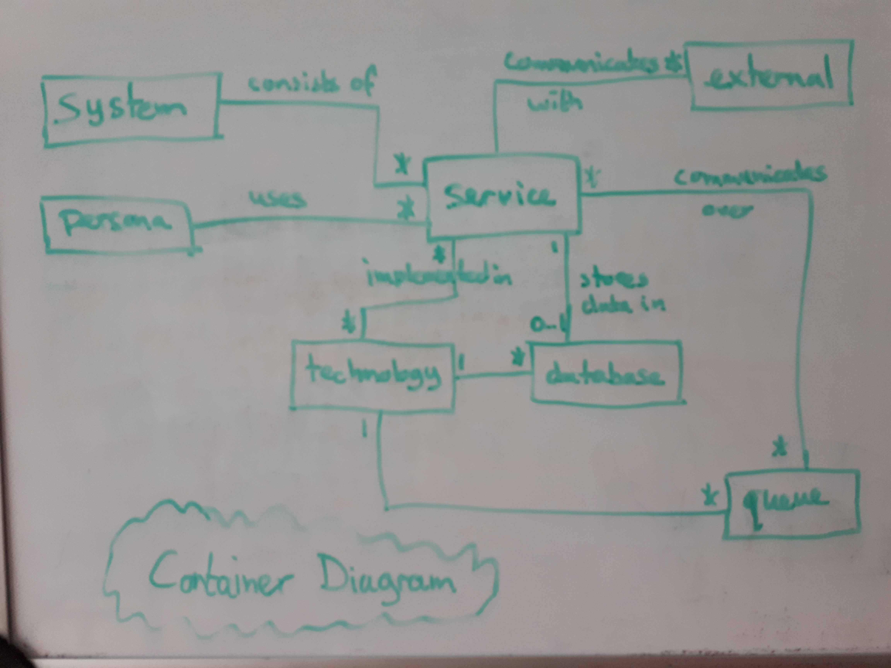

# A model for architecture diagrams

## Introduction

There are many types of diagrams. I regularly use [Context and Container Diagrams](https://c4model.com/) from the
C4 Model for showing the macro-architecture of systems and
[Data Flow Diagrams](https://en.wikipedia.org/wiki/Data-flow_diagram) (DFDs) as the basis for threat modeling.
There is a close relationship between a Container Diagram and a DFD.
Unfortunately, we don't have an underlying model that captures that relationship.
Such a model would allow us to generate both types of diagrams from the same source.

The [Structurizr](https://structurizr.com/) tool can do this for C4 diagrams, but not others.
Unfortunately, its underlying model is fairly simplistic and doesn't offer a lot of precision.
For instance, a service, database, and queue are all modeled as _containers_.
You have to apply tags on the container to make the tool draw them differently.
Another annoyance is that Structurizr only supports unidirectional relationships.

It would be great to have a better model, one that we can use in more places.
Let's consider another example next to the container diagram / DFD mapping: a container diagram lists technologies.
These technologies could be linked to a [Tech Radar](https://www.thoughtworks.com/radar) and maybe even to a
[Tech Debt](https://en.wikipedia.org/wiki/Technical_debt) inventory.

Another example is an [Event Model](https://eventmodeling.org/posts/what-is-event-modeling/).
It provides a really neat overview of the workflows in an event-driven architecture.
Such an architecture will have services that communicate via events that are delivered over queues.
Both services and queues are things you also see in a container diagram, so it would be cool if you could create a model
of your system that captures these things and from which you can generate both types of diagrams.

## Analysis

Let's look at the concepts used in the different types of diagrams mentioned before.
I'm sure there are other diagram types that would be useful to include, but for now let's stick with these five.
Here are some quick relationship diagrams that I cooked up to show the concepts used in the diagram types:

I'm sure the above pictures are incomplete.
That's fine, we can refine the model over time.
What's important now is that we can use them as a basis to build a better model for architectural diagrams.

The concepts in such a model are:

- **Activity** Something that happens in a _system_: a _command is issued_, an _event happened_, a _view gets updated_, 
  or an _external system gets called_.
- **Call** A machine-to-machine communication between two _participants_.
- **Command** A request to change the _system_ in some way.
  A command is issued by a _service_, _form_, or _external system_ and handled by a _service_.
- **Database** A part of a _system_ that stores data for one or more _services_.
- **Event** A piece of data sent from one _service_ to another, which signals to the recipient that something
  interesting has happened.
- **External system** A software application that the primary _system_ interacts with, but whose details don't concern
  us right now.
  We could define different types of external systems, for instance based on whether they are maintained by the
  organization itself or by a different organization.
- **Form** Part of the system that provides a User Interface to a _persona_.
  A form can show a view, let the _persona_ issue a _command_, or both.
- **Participant** A running piece of code that participates in a _call_, either as the initiator or as the target.
- **Performer** Someone or something that performs an _activity_.
- **Persona** A human that interacts with a _system_.
  A persona is not an actual person, but more the role they play when interacting with the _system_.
- **Queue** A part of a _system_ that temporarily stores data so that one _service_ can transfer that data to another
  _service_ asynchronously.
  The data transferred via the queue may be an _event_ (in which case we could call it an event bus or broker), but it
  could also be something else.
- **Service** A part of a _system_ that is deployed as a single unit, independently of other services.
  In a microservice architecture, this would be a microservice, but the concept also applies to Service Oriented
  Architectures.
  Either way, a service is stateless.
- **System** A software application that helps one or more _personas_ perform their duties and is the focus of the
  diagram.
- **Technology** The languages, frameworks, tools, platforms, etc. used to implement a part of a _system_.
- **Timeline** A sequence of _activities_, where one _activity_ in the sequence logically leads to the next.
- **View** A subset of the data in the _system_ that is prepared so that it can be easily queried for a specific purpose.
- **Workflow** A logical thread through the _system_ during which a _persona_ accomplishes something.
  A workflow consists of one or more _timelines_.

